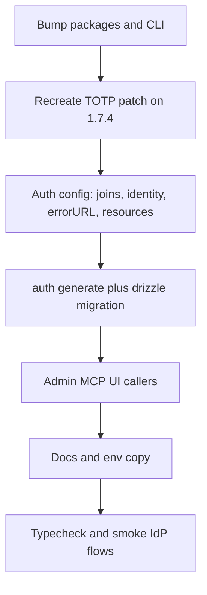

# Resolve Better Auth updates and OAuth error warning

The DevTools Insights panel is four items that land together:

- **OAuth Error Page Not Configured** — set `onAPIError.errorURL` and a page that reads `error` / `error_description`
- **better-auth 1.6.25 → 1.7.4** (and matching `@better-auth/oauth-provider`)
- **@better-auth/passkey 1.6.25 → 1.7.4**
- **@better-auth/infra 0.3.7 → 0.4.9**

This is a real 1.6 → 1.7 cutover, not a patch bump. Follow [Upgrading to Better Auth 1.7](https://better-auth.com/docs/guides/1-7-upgrade-guide). Do not run `npx auth upgrade` blindly — this repo has a TOTP patch and pinned community plugins.

## Recommendations (scope this upgrade)

Do the version bump. Stay conservative on **new 1.7 surfaces** so the kit stays an IdP starter that works in both extend-the-template and accounts-style modes.

**Project (what to ship now vs later)**

- **Now:** packages, error URL, `provider-id` identity, one protected resource, drizzle migration with backfill, admin field rename, TOTP patch if still needed.
- **Not in this PR:** `@better-auth/mcp` + CIMD (replace the demo echo route later as its own feature). Official `@better-auth-ui` swap. SCIM / `managedDirectorySync`. Re-keying accounts to `identityStrategy: "issuer"`. Extra resources for MCP/APIs that do not exist yet.
- **Later (aligns with the federated IdP vision):** add resources as first-class APIs (MCP, product API) with per-resource TTL/scopes; consider an issuer-strategy re-key when Bluesky / wallets land so the same protocol subject is one account. Keep `auth.ts` as wiring only ([modular-dev](.agents/skills/modular-dev/SKILL.md)).

**Scalability (kit + deploys)**

- **Migrations:** keep **drizzle-kit** (`pnpm db:sync`) as the starter contract. Inspectable SQL in git, same path for Cloudflare/Railway/Dokploy (`db:migrate` on boot). Official `auth migrate plan/apply` is better for a *single* live product DB; document it as an operator option, do not make the kit depend on an interactive CLI.
- **Identity:** `"provider-id"` is the supported 1.6 cutover (no collision re-key). `"issuer"` is the better long-term federated model but is a separate data migration — do not mix it into this bump.
- **Resources:** one default resource (`BETTER_AUTH_URL` / `OAUTH_AUDIENCE`). Backfill `oauth_client_resource` for existing clients. Set DCR default/allowed resources to that identifier. **Do not** set `enforcePerClientResources: false` — that fights the trust-tier model as client count grows. Adding a second resource later is appending to the `resources` list.
- **Joins:** keep `advanced.database.joins: true` (already on via `experimental.joins`). That is the cheap query-scale win for session/org reads.
- **Serverless:** 1.7 sign-out revokes tokens and may send back-channel logout. If Cloudflare Workers runtime is in use, wire `advanced.backgroundTasks.handler` in a follow-up; the default Containers path does not need it for this PR.
- **Tokens:** document that ID tokens no longer carry profile/email (UserInfo only). Do not paper over that — clients should already call userinfo in accounts-style mode.

**MCP helper:** only rename `mcpHandler` so the existing demo route compiles. Do not adopt `@better-auth/mcp` here.




## 1. Bump packages together

In [package.json](package.json):

- `better-auth`, `@better-auth/oauth-provider`, `@better-auth/passkey` → `^1.7.4`
- `@better-auth/infra` → `^0.4.9`
- `@better-auth/cli` → `^1.7.4` (today it is `^1.4.21`)
- Add `@better-auth/drizzle-adapter` if 1.7 no longer re-exports `better-auth/adapters/drizzle` (1.7 drizzle docs import from `@better-auth/drizzle-adapter`)

Pin the whole `@better-auth/*` set to the same 1.7.4 line. After install, if the drizzle adapter import path moved, update [src/lib/auth.ts](src/lib/auth.ts).

## 2. Recreate the TOTP patch

[patches/better-auth@1.6.25.patch](patches/better-auth@1.6.25.patch) lets a valid TOTP code repair legacy accounts whose `two_factors.verified` row is false. That is documented kit behavior in [docs/framework/features.mdx](docs/framework/features.mdx).

1.7 still gates TOTP on `verified`. After installing 1.7.4, inspect `node_modules/better-auth/.../two-factor/totp` and re-apply the same skip-unverified-on-sign-in change. Rename the patch to `better-auth@1.7.4` and update `pnpm.patchedDependencies`. Drop the patch only if upstream already matches this behavior.

## 3. Auth config (clears the OAuth warning + 1.7 breaks)

In [src/lib/auth.ts](src/lib/auth.ts):

**Error page (the Insights CONFIGURATION item):**

```ts
onAPIError: { errorURL: "/auth/error" }
```

`/auth/[path]` already renders `AuthView` for daveyplate paths. If `authViewPaths` includes `error`, that is enough. If not, add a small `/auth/error` page that shows `error` and `error_description` query params and a link back to `/auth/sign-in`.

**Joins + identity:**

```ts
// replace experimental: { joins: true }
advanced: {
  ipAddress: { ipAddressHeaders: ["x-forwarded-for", "x-real-ip"] },
  database: { joins: true },
},
account: { identityStrategy: "provider-id" },
```

`"provider-id"` is the supported 1.6 → 1.7 path (synthetic issuers like `local:credential`, `local:oauth:nostr`).

**OAuth provider (this app is an IdP):**

- Replace `validAudiences` with `resources: [authOrigin or OAUTH_AUDIENCE]`
- Set `clientRegistrationDefaultResources` / `clientRegistrationAllowedResources` to the same identifier so DCR/MCP token requests are not rejected with `invalid_target`
- Remove `silenceWarnings` (gone in 1.7)
- Keep existing login/consent/scope/DCR options

Backfill `oauth_client_resource` for every existing client to the default resource. Do not disable `enforcePerClientResources`.

**MCP helper:** [src/app/api/mcp/[transport]/route.ts](src/app/api/mcp/[transport]/route.ts) imports `mcpHandler` from `@better-auth/oauth-provider`. Update the import/wrapper to whatever 1.7 exports (`createMcpProtectedRequestHandler` / `requireMcpAuth`). Do not add `@better-auth/mcp` in this PR.

**Resource client:** confirm [src/lib/server-client.ts](src/lib/server-client.ts) still compiles (`verifyAccessToken` → `verifyBearerToken` if used).

## 4. Schema + drizzle migration

1. Point generate at the 1.7 config, then run `pnpm db:auth` / `npx auth generate` so [auth-schema.ts](auth-schema.ts) gains:
  - `accounts.issuer` + unique `(issuer, accountId)`
  - OAuth client columns: `applicationType`, `clientDiscoveryId`, `clientCredentialsScopes`; drop legacy `type` / `public` after backfill
  - Resource tables / token columns / relations as generated
2. Enable adapter `transaction: true` if the generated CLI expects it (`drizzleAdapter(db, { provider: "pg", usePlural: true, schema, transaction: true })`).
3. `pnpm db:gen` then **edit** the SQL before apply:
  - Add `issuer` as nullable
  - Backfill: credential rows → `local:credential`; other `providerId`s → `local:oauth:` + `encodeURIComponent(providerId)`
  - Then `SET NOT NULL` + unique index
  - Map existing `web`/`native`/`public` client rows onto `applicationType` + `tokenEndpointAuthMethod` (`none` only for public)
  - Insert `oauth_client_resource` rows linking each existing client to the default resource
4. Apply with `pnpm db:migrate`

Never apply a generated NOT NULL `issuer` over populated 1.6 `accounts` without that backfill.

## 5. Call sites that use removed client fields

Admin UI still reads `oauthClients.public` / writes `{ public: data.isPublic }`:

- [src/lib/actions/admin-clients.ts](src/lib/actions/admin-clients.ts)
- [src/components/admin/client-form.tsx](src/components/admin/client-form.tsx)
- [src/components/admin/client-table.tsx](src/components/admin/client-table.tsx)

Switch those to 1.7 fields (`tokenEndpointAuthMethod === "none"` for public, `applicationType` for web/native). Keep the same admin UX.

## 6. Docs

Per [keep-docs-updated](.agents/skills/keep-docs-updated/SKILL.md):

- [docs/framework/features.mdx](docs/framework/features.mdx) — OAuth error page; resource identifier instead of audience list
- [docs/framework/environment-variables.mdx](docs/framework/environment-variables.mdx) + [.env.example](.env.example) — `OAUTH_AUDIENCE` now names the protected resource / JWT `aud`
- [docs/framework/client-trust-model.mdx](docs/framework/client-trust-model.mdx) — DCR default resources
- [docs/framework/typescript-better-invite.mdx](docs/framework/typescript-better-invite.mdx) — still 1.6-era copy; keep the type shim if 1.7 still needs it, and retarget the version note
- [docs/framework/getting-started.mdx](docs/framework/getting-started.mdx) / [deployment.mdx](docs/framework/deployment.mdx) — existing deploys must run the new migration before starting 1.7

## 7. Verify

- `pnpm check-types` and `pnpm lint`
- Community plugins (`better-invite`, `better-auth-nostr`, `@dbsc-toolkit/better-auth`, `better-auth-devtools`, `@daveyplate/better-auth-ui`) — fix type shims if 1.7 inference breaks; do not swap UI libraries unless types fail
- DevTools Insights: the three UPDATE cards and the OAuth CONFIGURATION warning should clear after restart
- Smoke: email/password + TOTP (including a legacy unverified row if the patch remains), passkey, OAuth authorize → consent → token, discovery, admin clients, `/auth/error?error=access_denied`

**Risk:** 1.7 ID tokens no longer carry profile/email claims (UserInfo only). Client apps that parse those from the ID token will need UserInfo — document, do not change token shape back.